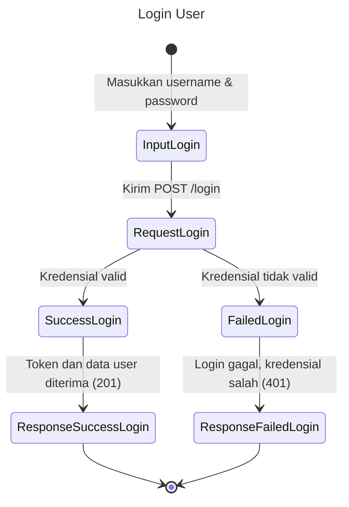
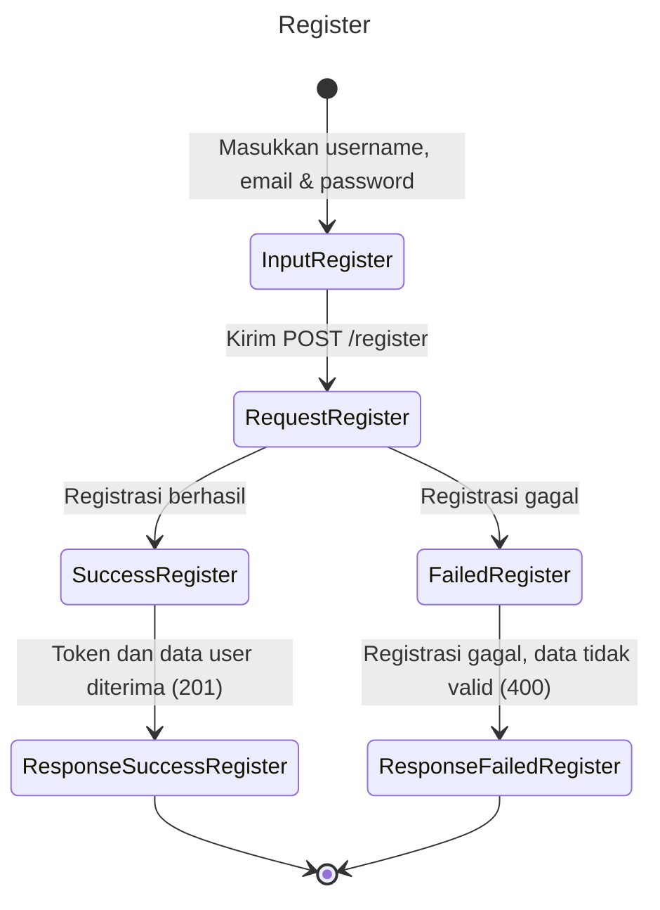
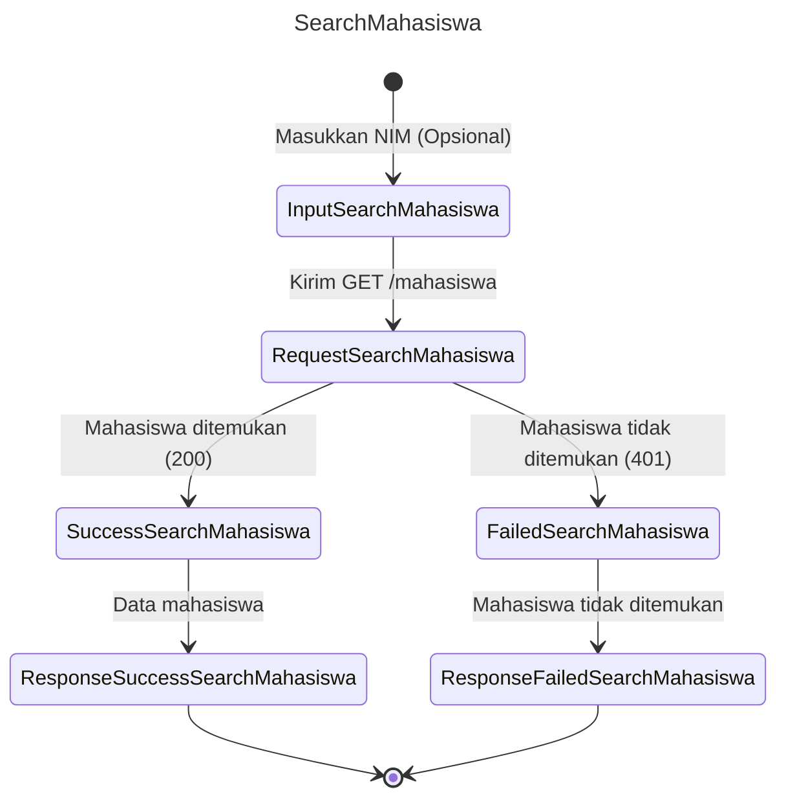
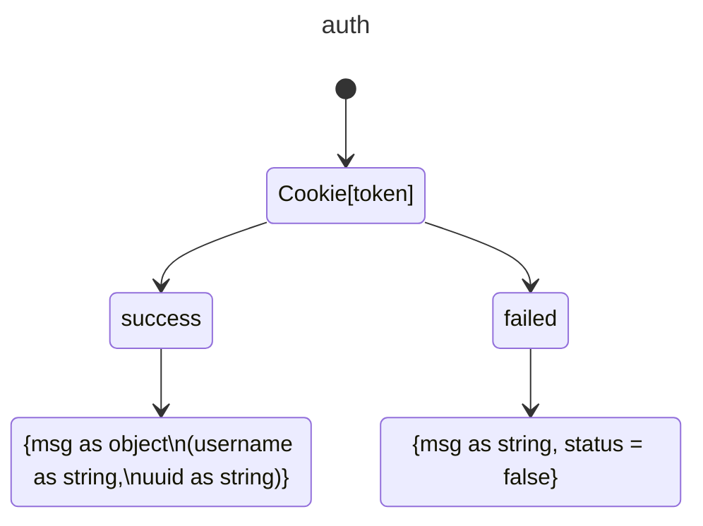

LAPORAN LAB BACKEND
NEST JS
Disusun Oleh: A. Fachri (105841106522)

Kata Pengantar
Puji syukur kehadirat Allah SWT atas rahmat dan karunia-Nya, sehingga laporan laboratorium backend ini dapat diselesaikan dengan baik. Laporan ini merupakan hasil dari serangkaian percobaan dan eksplorasi mengenai framework NestJS.

NestJS, sebagai framework Node.js yang progresif, menawarkan arsitektur modular dan penggunaan TypeScript yang membantu para pengembang dalam membangun aplikasi yang efisien, andal, dan mudah diskalakan. Dalam laporan ini, penulis akan membahas berbagai aspek penting dari NestJS, mulai dari pengenalan dan instalasi, hingga fitur-fitur seperti autentikasi, middleware, guard, decorator, dan WebSocket.

Laporan ini diharapkan dapat memberikan pemahaman tentang NestJS, serta menjadi panduan praktis bagi para pengembang yang ingin memanfaatkan keunggulan framework ini dalam membangun aplikasi backend. Penulis juga berharap laporan ini dapat menjadi kontribusi positif dalam pengembangan teknologi informasi di Indonesia.

Penulis menyadari bahwa laporan ini masih jauh dari sempurna. Oleh karena itu, segala kritik dan saran yang membangun sangat penulis harapkan demi penyempurnaan laporan ini di masa mendatang.

Akhir kata, penulis mengucapkan terima kasih kepada semua pihak yang telah berkontribusi dalam penyusunan laporan ini. Semoga laporan ini dapat bermanfaat bagi para pembaca.

BAB I 
PENDAHULUAN
1.1. Latar Belakang
Perkembangan teknologi informasi yang pesat telah mendorong kebutuhan akan aplikasi web yang semakin kompleks dan dinamis. Aplikasi-aplikasi modern ini menuntut arsitektur yang kuat, kinerja tinggi, dan kemudahan dalam pengembangan serta pemeliharaan. Dalam konteks ini, framework backend memiliki peran krusial dalam menyediakan fondasi yang kokoh untuk membangun aplikasi sisi server.

Node.js, sebagai lingkungan runtime JavaScript yang populer, telah menjadi pilihan bagi banyak pengembang dalam membangun aplikasi web. Namun, dengan semakin kompleksnya aplikasi, tantangan dalam mengatur dan memelihara kode juga semakin meningkat. Oleh karena itu, muncullah berbagai framework Node.js yang bertujuan untuk mempermudah pengembangan aplikasi yang terstruktur dan mudah diskalakan.

Salah satu framework yang menonjol dalam kategori ini adalah NestJS. NestJS, sebagai framework Node.js yang progresif, menawarkan arsitektur modular yang kuat dan penggunaan TypeScript yang membantu para pengembang dalam membangun aplikasi yang efisien, andal, dan mudah diskalakan. Dengan fitur-fitur canggih seperti dependency injection, middleware, guard, dan decorator, NestJS memungkinkan para pengembang untuk fokus pada logika bisnis aplikasi tanpa harus khawatir tentang detail implementasi teknis yang rumit.

1.2. Rumusan Masalah
Berdasarkan latar belakang di atas, rumusan masalah dalam laporan ini adalah:
1. Bagaimana mengimplementasikan fitur-fitur penting dalam pengembangan aplikasi backend menggunakan NestJS, seperti autentikasi, middleware, guard, decorator, dan WebSocket?
2. Bagaimana memanfaatkan NestJS bersama dengan teknologi lain seperti Prisma untuk membangun aplikasi backend yang modern dan efisien?

1.3. Tujuan
Laporan ini bertujuan untuk:
1. Memberikan pemahaman yang komprehensif tentang framework NestJS dan fitur-fitur yang ditawarkannya dalam pengembangan aplikasi backend.
2. Menyajikan panduan tentang implementasi fitur-fitur penting dalam pengembangan aplikasi backend menggunakan NestJS, seperti autentikasi, middleware, guard, decorator, dan WebSocket.
3. Menunjukkan contoh penggunaan NestJS bersama dengan teknologi lain seperti Prisma dalam membangun aplikasi backend yang modern dan efisien.

1.4. Ruang Lingkup
Laporan ini akan membahas berbagai aspek dari NestJS, mulai dari pengenalan dan instalasi, hingga fitur-fitur seperti autentikasi, middleware, guard, decorator, dan WebSocket. Selain itu, laporan ini juga akan membahas penggunaan NestJS bersama dengan Prisma untuk interaksi dengan database.

1.5 Sistematika Penulisan
- BAB I: PENDAHULUAN
- BAB II: PEMBAHASAN
- BAB III: KESIMPULAN

BAB II
PEMBAHASAN

1.1. Apa itu Backend?
Backend adalah bagian dari pengembangan perangkat lunak yang berfungsi
sebagai otak atau penggerak aplikasi. Backend bertanggung jawab untuk mengelola
data, logika bisnis, autentikasi, dan komunikasi antara frontend (antarmuka
pengguna) dan server atau database. Jika frontend adalah bagian aplikasi yang
terlihat oleh pengguna, backend adalah bagian yang bekerja di belakang layar untuk
memastikan semuanya berjalan lancar.

1.2. Apa itu NestJS?
NestJS adalah framework backend progresif berbasis TypeScript (dapat juga
digunakan dengan JavaScript) yang dirancang untuk membangun aplikasi serverside
yang efisien, skalabel, dan dapat dipelihara. Framework ini menggunakan arsitektur modular dan memanfaatkan konsep-konsep modern dari Node.js serta pola desain seperti Dependency Injection (DI) dan Inversion of Control (IoC). NestJS terinspirasi oleh framework seperti Angular di frontend, sehingga memiliki struktur yang terorganisasi dengan baik dan mudah dipelajari oleh pengembang yang sudah familiar dengan Angular.

1.2.1. Cara Membuat Proyek NestJS
1. Install nest js CLI dengan menggunakan perintah 
“npm i -g @nestjs/cli”
2. Inisialisasi proyek nest js dengan menggunakan perintah 
“nest new nama_proyek”
3. Masuk ke direktori dengan perintah
“cd nama_proyek”

1.2.2. Setup Swagger di Nest JS
1. Di direktori proyek, masukkan perintah “npm i –save @nestjs/swagger”
2. Buka folder proyek di vscode menggunakan perintah “code .”
3. Masuk ke main.ts lalu rubah semua codenya menjadi seperti ini:
import { NestFactory } from '@nestjs/core'; 
import { AppModule } from './app.module'; 
import { DocumentBuilder, SwaggerModule } from '@nestjs/swagger'; 
 
async function bootstrap() { 
  const app = await NestFactory.create(AppModule); 
 
  const config = new DocumentBuilder() 
    .setTitle('Latihan Nest JS kelas - C') 
    .setDescription('Muhammad Fachri Rasyidi - 105841106320') 
    .setVersion('0.1') 
    .addTag('Latihan 1') 
    .build(); 
 
  const documentFactory = () => SwaggerModule.createDocument(app,  
    config); 
 
  SwaggerModule.setup('api-docs', app, documentFactory); 
 
  await app.listen(process.env.PORT ?? 3030); 
} 
bootstrap(); 

1.2.3. Jalankan Nest JS
1. Untuk menjalankan nest JS. Harus buka folder proyek nest js, kemudian ketik “npm
start”,
2. Untuk menjalankan nest js dalam mode development(pengembangan) harus
menggunakan perintah “npm run start:dev”

1.3. Controller dan Services Nest JS
1. Controller: Bayangkan sebuah hotel mewah. Resepsionis hotel adalah analogi yang tepat untuk Controller 
dalam aplikasi NestJS. Resepsionis adalah orang pertama yang berinteraksi dengan tamu (klien
aplikasi Anda).
2. Service: Mari lanjutkan dengan analogi hotel. Service dalam aplikasi NestJS seperti dapur dan ruang 
operasi hotel. Service adalah tempat di mana semua pekerjaan "berat" dan logika bisnis dilakukan.

1.3.1. Tugas dari Controller dan Service
1. Controller
a. Menerima Tamu (Permintaan HTTP): Resepsionis menyambut tamu yang datang ke hotel,
baik itu tamu yang datang langsung (misalnya, melalui browser) atau melalui telepon
(misalnya, aplikasi mobile). Dalam NestJS, ini berarti Controller menerima permintaan
HTTP, seperti GET, POST, PUT, atau DELETE, yang ditujukan ke endpoint tertentu (URL). 
b. Mendengarkan Keinginan Tamu (Data Request): Resepsionis mendengarkan apa yang
diinginkan tamu, apakah itu meminta kamar, menanyakan informasi, atau melakukan
pemesanan. Dalam NestJS, Controller mengekstrak informasi dari permintaan HTTP, seperti
parameter di URL (misalnya, /users/123), data dalam request body (misalnya, data yang
dikirimkan dalam format JSON), atau query parameter (misalnya,
/products?category=books). 
c. Mendelegasikan Tugas (Memanggil Service): Resepsionis tidak langsung membuat kamar
atau membersihkan kamar sendiri. Ia mendelegasikan tugas tersebut kepada staf hotel yang
sesuai (misalnya, petugas kebersihan atau staf dapur). Dalam NestJS, Controller
mendelegasikan tugas ke Service untuk melakukan logika bisnis yang dibutuhkan. Controller
tidak melakukan logika bisnis sendiri; ia hanya tahu ke Service mana ia harus menugaskan
pekerjaan. 
d. Menerima Hasil dari Staf (Data dari Service): Resepsionis menerima informasi dari staf,
seperti nomor kamar yang tersedia atau status pesanan makanan. Dalam NestJS, Controller
menerima data hasil dari Service, yang telah memproses logika bisnis dan mengambil atau
memanipulasi data. 
e. Menyampaikan Informasi ke Tamu (Respons HTTP): Resepsionis menyampaikan
informasi kepada tamu, seperti nomor kamar, tagihan, atau jadwal kegiatan hotel. Dalam
NestJS, Controller mengubah data dari Service (jika perlu) menjadi format yang sesuai
(misalnya, JSON) dan mengirimkannya kembali ke klien sebagai respons HTTP.

2. Service
a. Menerima Pesanan dari Resepsionis (Controller): Dapur dan ruang operasi menerima
instruksi dari resepsionis (Controller), seperti permintaan untuk membuatkan makanan,
membersihkan kamar, atau melakukan check-in. Dalam NestJS, Service menerima data dari
Controller dan mulai melakukan logika bisnis.
b. Mengolah Data (Logika Bisnis): Dapur memasak makanan berdasarkan pesanan, ruang
operasi melakukan check-in dan mengatur kamar. Dalam NestJS, Service melakukan berbagai
logika bisnis, seperti: 
o Mengakses data dari database (misalnya, mengambil daftar user atau product). 
o Memvalidasi data. 
o Memanipulasi data (misalnya, mengubah format atau menghitung nilai). 
o Memanggil API eksternal. 
o Mengimplementasikan alur kerja bisnis.
c. Berinteraksi dengan Sumber Data (Database): Dapur menyimpan bahan makanan, ruang
operasi menyimpan informasi kamar. Dalam NestJS, Service berinteraksi dengan database,
API, atau sumber data lain untuk mendapatkan atau menyimpan informasi.
d. Mengembalikan Hasil ke Resepsionis (Controller): Setelah tugas selesai, dapur
mengembalikan makanan yang sudah siap, ruang operasi memberikan data kamar. Dalam
NestJS, Service mengembalikan hasil dari logika bisnis ke Controller. 

1.4. Module dan Prisma JS
1. Module (Rak): Tempat kita nmenyimpan "dapur" dan "pelayan". Jadi, biar rapi dan gampang dicari.
2. Prisma (Alat Masak): Buat "ngurus" data di database. Jadi, kita tidak perlu repot-repot nulis kode buat "ngambil" atau "nyimpen" data.

1.5. Middleware, Guard and Decorator
1. Middleware adalah perangkat lunak yang terletak di antara sistem operasi dan aplikasi pada perangkat atau antara dua komponen sistem dalam suatu aplikasi. Di konteks aplikasi web, middleware adalah fungsi yang dijalankan sebelum permintaan (request) mencapai route handler atau controller. Fungsi utamanya adalah memproses request dan response, seperti:
a. Logging: Mencatat aktivitas request.
b. Autentikasi: Memvalidasi identitas pengguna.
c. Manipulasi Request/Response: Menambah, memodifikasi, atau memvalidasi data.
d. Error Handling: Mengelola error yang terjadi selama proses request.
2. Middleware umumnya digunakan untuk menyederhanakan pipeline request-response dalam aplikasi web.

1.6. File
1. File Uploader
Alur dari mengupload sebuah file ke dalam backend secara local biasanya melewati beberapa tahap sebagai berikut : 
a. File akan dikirimkan melalui request. Untuk dapat mengirimkan sebuah file, biasanya client akan mengirimkannya dalam bentuk Form. Berbeda dengan cara pengiriman data seperti biasanya, untuk menerima data dalam bentuk Form juga harus memerlukan sebuah konfigurasi untuk endpoint yang akan menerimanya. Data yang bukan gambar yang dikirimkan melalui Form akan selalu bertipe string.
b. Dikarenakan tipe selain gambar biasanya bertipe string, maka kita memerlukan class-transformer untuk mengubahnya menjadi tipe data yang sesuai sebelum memprosesnya di service.
c. Untuk Field yang bertipe gambar, biasanya akan diambil data buffer dan filename. Data Buffer biasanya berisikan data gambar itu sendiri, dan filename biasanya digunakan untuk membantu penamaan file untuk disimpan di dalam folder local proyeknya.
d. Menggunakan library fs untuk membuat file dari property buffer dari gambar yang didapatkan. Lalu menyimpan file tersebut di sebuah folder di luar src. Biasanya folder untuk folder disimpan di dalam folder yang bernama “uploads”.
e. Menyimpan nama file beserta nama foldernya di database untuk digunakan lagi jika User ingin mengget Kembali datanya.

2. File Getter
a. Bermodalkan data filename dari database. Kita bisa membuat sebuah endpoint yang dapat mengget file dari filename menggunakan library fs.
b. Lalu kita mengsend data tersebut menggunakan Response milik express. Biasanya data selain gambar akan detreat untuk didownload oleh client.

1.7. Params
Dalam pengembangan aplikasi web, terutama yang menggunakan arsitektur RESTful, params adalah bagian dari URL yang digunakan untuk mengidentifikasi sumber daya (resources) tertentu. params biasanya muncul setelah nama resource dalam URL.

Contoh:
Dalam URL berikut: https://example.com/users/123, angka 123 adalah param yang mengidentifikasi user dengan ID 123.
Bagaimana cara menggunakan params di NestJS?
NestJS menyediakan decorator @Param() untuk mengambil nilai params dari URL. Decorator ini digunakan di dalam controller.

1.8. WebSocket
1.8.1. Apa itu WebSocket?
WebSocket adalah protokol komunikasi yang diinisialisasi melalui HTTP, tetapi kemudian upgrade ke koneksi WebSocket setelah handshake awal. Ini memungkinkan server dan client untuk saling mengirim data kapan saja tanpa perlu menunggu permintaan dari pihak lain.

1.8.2. Cara Kerja WebSocket
a. Handshake Awal:
- Client mengirim permintaan HTTP ke server dengan header khusus (Upgrade: websocket).
- Jika server mendukung WebSocket, server akan merespons dengan status code 101 Switching Protocols, yang menandakan bahwa koneksi akan di-upgrade ke WebSocket.
- Setelah handshake ini, koneksi HTTP diubah menjadi koneksi WebSocket.
b. Koneksi Persisten
- Setelah handshake, koneksi tetap terbuka, dan server dan client dapat saling mengirim data kapan saja.
- Data dikirim dalam bentuk frame (bingkai) yang ringan, yang mengurangi overhead dibandingkan dengan HTTP.
c. Pertukaran Data
- Server dan client dapat mengirim pesan (message) secara independen tanpa perlu menunggu permintaan dari pihak lain.
- Pesan dapat berupa teks (text frames) atau data biner (binary frames).
d. Penutupan Koneksi
- Koneksi WebSocket dapat ditutup oleh server atau client dengan mengirim frame penutup (close frame).

BAB III
KESIMPULAN
Perkembangan teknologi informasi menuntut aplikasi backend yang efisien, skalabel, dan mudah dipelihara. Dalam hal ini, NestJS hadir sebagai framework backend berbasis TypeScript yang menawarkan arsitektur modular serta berbagai fitur canggih, seperti dependency injection, middleware, guard, decorator, dan WebSocket.

Laporan ini telah membahas berbagai aspek dari NestJS, mulai dari instalasi hingga implementasi fitur penting dalam pengembangan backend. Selain itu, dijelaskan pula bagaimana NestJS dapat dikombinasikan dengan Prisma untuk pengelolaan database yang lebih efisien.

Dalam pengembangan aplikasi backend, konsep controller dan service memainkan peran penting dalam memisahkan logika bisnis dan pengelolaan data. Selain itu, penggunaan middleware, guard, serta decorator semakin meningkatkan keamanan dan fleksibilitas aplikasi. Teknologi WebSocket juga dibahas sebagai solusi komunikasi real-time yang efisien.

Dengan memahami konsep dan fitur yang ditawarkan oleh NestJS, pengembang dapat membangun aplikasi backend yang modern, handal, dan mudah diskalakan.

# Diagram Proyek

