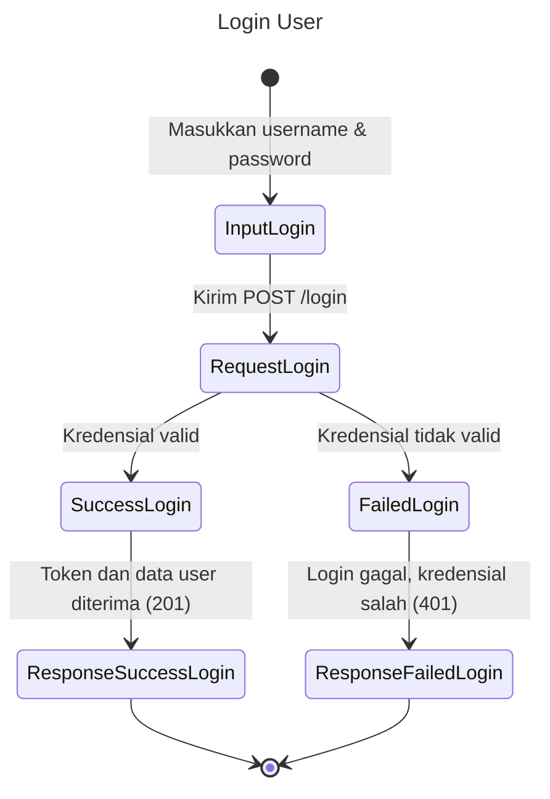
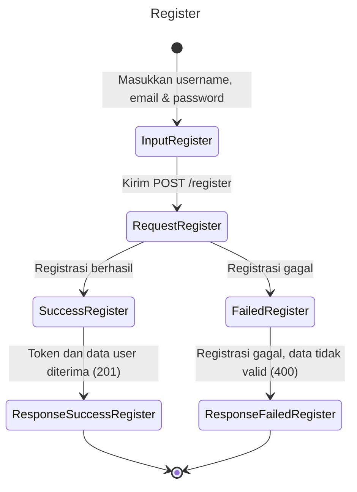
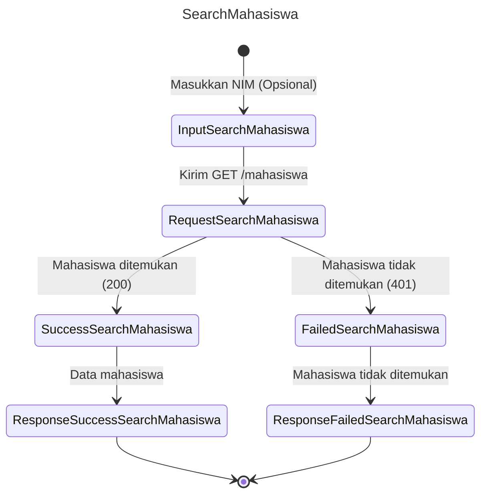
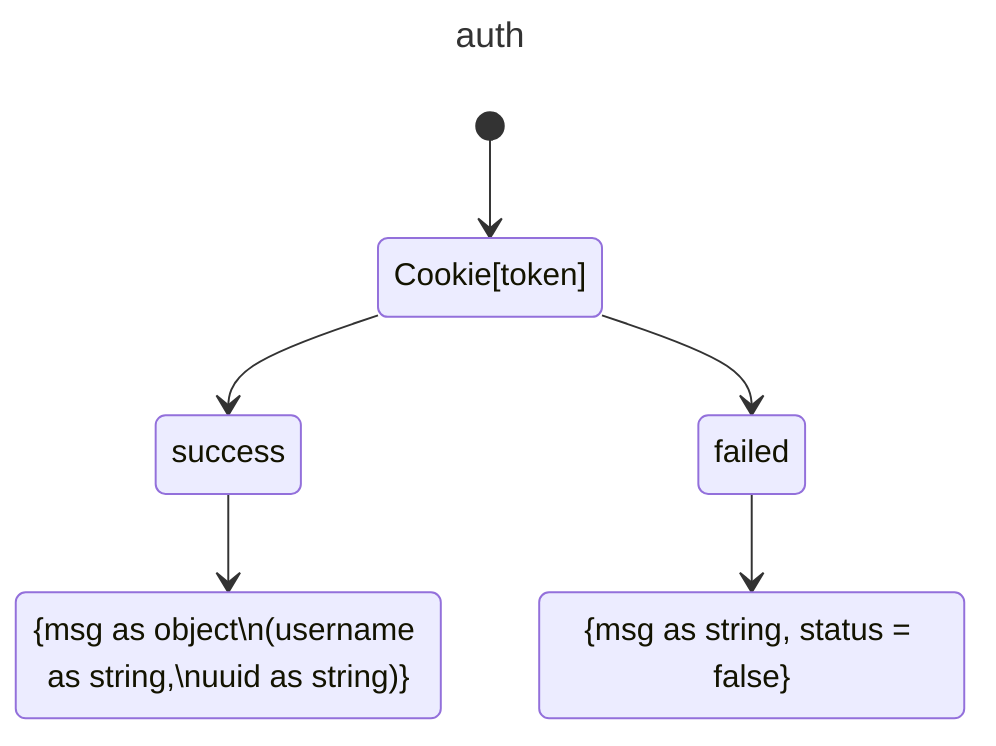

LAPORAN LAB BACKEND

NEST JS

Disusun Oleh: A. Fachri (105841106522)

Kata Pengantar

Puji syukur kehadirat Allah SWT atas limpahan rahmat dan karunia-Nya, sehingga laporan laboratorium backend ini dapat terselesaikan dengan baik. Laporan ini merupakan hasil dari serangkaian percobaan dan eksplorasi mendalam mengenai framework NestJS.

Sebagai framework Node.js yang progresif, NestJS menawarkan arsitektur modular serta integrasi penuh dengan TypeScript, menjadikannya pilihan yang andal untuk membangun aplikasi backend yang efisien, skalabel, dan mudah dikelola. Dalam laporan ini, penulis akan membahas berbagai aspek penting dari NestJS, mulai dari pengenalan dan instalasi, hingga fitur-fitur autentikasi, middleware, guard, decorator, serta WebSocket.

Laporan ini diharapkan dapat memberikan pemahaman yang komprehensif tentang NestJS sekaligus menjadi panduan praktis bagi para pengembang yang ingin memaksimalkan potensi framework ini dalam membangun aplikasi backend. Semoga laporan ini juga dapat berkontribusi bagi perkembangan teknologi informasi di Indonesia.

Penulis menyadari bahwa laporan ini masih memiliki kekurangan. Oleh karena itu, kritik dan saran yang membangun sangat diharapkan guna penyempurnaan di masa mendatang.
Penulis mengucapkan terima kasih yang sebesar-besarnya kepada semua pihak yang telah berkontribusi dalam penyusunan laporan ini. Semoga laporan ini dapat memberikan manfaat bagi para pembaca dan menjadi inspirasi dalam eksplorasi lebih lanjut di dunia pengembangan backend.

*_Latar Belakang_*

Perkembangan teknologi informasi yang pesat telah mendorong kebutuhan akan aplikasi web yang semakin kompleks dan dinamis. Aplikasi-aplikasi modern ini menuntut arsitektur yang kuat, kinerja tinggi, dan kemudahan dalam pengembangan serta pemeliharaan. Dalam konteks ini, framework backend memiliki peran krusial dalam menyediakan fondasi yang kokoh untuk membangun aplikasi sisi server.

Node.js, sebagai lingkungan runtime JavaScript yang populer, telah menjadi pilihan bagi banyak pengembang dalam membangun aplikasi web. Namun, dengan semakin kompleksnya aplikasi, tantangan dalam mengatur dan memelihara kode juga semakin meningkat. Oleh karena itu, muncullah berbagai framework Node.js yang bertujuan untuk mempermudah pengembangan aplikasi yang terstruktur dan mudah diskalakan.

Salah satu framework yang menonjol dalam kategori ini adalah NestJS. NestJS, sebagai framework Node.js yang progresif, menawarkan arsitektur modular yang kuat dan penggunaan TypeScript yang membantu para pengembang dalam membangun aplikasi yang efisien, andal, dan mudah diskalakan. Dengan fitur-fitur canggih seperti dependency injection, middleware, guard, dan decorator, NestJS memungkinkan para pengembang untuk fokus pada logika bisnis aplikasi tanpa harus khawatir tentang detail implementasi teknis yang rumit.

*_Teknologi Yang Digunakan_*

Adapun teknologi yang digunakan dalam Projek ini
    - Node.js: JavaScript runtime yang dibangun di atas mesin V8 Chrome.
    - *NestJS: Framework untuk membangun aplikasi server-side yang efisien dan skalabel.
    - TypeScript: Superset dari JavaScript yang menambahkan tipe statis.
    - Prisma: ORM (Object-Relational Mapping) untuk TypeScript dan Node.js.
    - Jest: Framework pengujian JavaScript yang fokus pada kesederhanaan.
    - Prettier: Code formatter yang mendukung berbagai bahasa pemrograman.
    - ESLint: Linter untuk JavaScript dan TypeScript yang membantu menjaga kualitas kode.
    - Docker: Platform untuk mengembangkan, mengirim, dan menjalankan aplikasi dalam container

*_Apa itu NestJS?_*

NestJS adalah framework backend progresif berbasis TypeScript (dapat juga
digunakan dengan JavaScript) yang dirancang untuk membangun aplikasi serverside
yang efisien, skalabel, dan dapat dipelihara. Framework ini menggunakan arsitektur modular dan memanfaatkan konsep-konsep modern dari Node.js serta pola desain seperti Dependency Injection (DI) dan Inversion of Control (IoC). NestJS terinspirasi oleh framework seperti Angular di frontend, sehingga memiliki struktur yang terorganisasi dengan baik dan mudah dipelajari oleh pengembang yang sudah familiar dengan Angular.

*_Cara Membuat Proyek NestJS_*

1. Install nest js CLI dengan menggunakan perintah 
“npm i -g @nestjs/cli”
2. Inisialisasi proyek nest js dengan menggunakan perintah 
“nest new nama_proyek”
3. Masuk ke direktori dengan perintah
“cd nama_proyek”

*_Setup Swagger di Nest JS_*

1. Di direktori proyek, masukkan perintah “npm i –save @nestjs/swagger”
2. Buka folder proyek di vscode menggunakan perintah “code .”
3. Masuk ke main.ts lalu rubah semua codenya menjadi seperti ini:
import { NestFactory } from '@nestjs/core'; 
import { AppModule } from './app.module'; 
import { DocumentBuilder, SwaggerModule } from '@nestjs/swagger'; 
 
async function bootstrap() { 
  const app = await NestFactory.create(AppModule); 
 
  const config = new DocumentBuilder() 
    .setTitle('Latihan Nest JS kelas - C') 
    .setDescription('Muhammad Fachri Rasyidi - 105841106320') 
    .setVersion('0.1') 
    .addTag('Latihan 1') 
    .build(); 
 
  const documentFactory = () => SwaggerModule.createDocument(app,  
    config); 
 
  SwaggerModule.setup('api-docs', app, documentFactory); 
 
  await app.listen(process.env.PORT ?? 3030); 
} 
bootstrap(); 

*_Jalankan Nest JS_*
1. Untuk menjalankan nest JS. Harus buka folder proyek nest js, kemudian ketik “npm
start”,
2. Untuk menjalankan nest js dalam mode development(pengembangan) harus
menggunakan perintah “npm run start:dev”

*_Tugas dari Controller dan Service_*

1. Controller
   
a. Menerima Tamu (Permintaan HTTP): Resepsionis menyambut tamu yang datang ke hotel,
baik itu tamu yang datang langsung (misalnya, melalui browser) atau melalui telepon
(misalnya, aplikasi mobile). Dalam NestJS, ini berarti Controller menerima permintaan
HTTP, seperti GET, POST, PUT, atau DELETE, yang ditujukan ke endpoint tertentu (URL). 
b. Mendengarkan Keinginan Tamu (Data Request): Resepsionis mendengarkan apa yang
diinginkan tamu, apakah itu meminta kamar, menanyakan informasi, atau melakukan
pemesanan. Dalam NestJS, Controller mengekstrak informasi dari permintaan HTTP, seperti
parameter di URL (misalnya, /users/123), data dalam request body (misalnya, data yang
dikirimkan dalam format JSON), atau query parameter (misalnya,
/products?category=books). 
c. Mendelegasikan Tugas (Memanggil Service): Resepsionis tidak langsung membuat kamar
atau membersihkan kamar sendiri. Ia mendelegasikan tugas tersebut kepada staf hotel yang
sesuai (misalnya, petugas kebersihan atau staf dapur). Dalam NestJS, Controller
mendelegasikan tugas ke Service untuk melakukan logika bisnis yang dibutuhkan. Controller
tidak melakukan logika bisnis sendiri; ia hanya tahu ke Service mana ia harus menugaskan
pekerjaan. 
d. Menerima Hasil dari Staf (Data dari Service): Resepsionis menerima informasi dari staf,
seperti nomor kamar yang tersedia atau status pesanan makanan. Dalam NestJS, Controller
menerima data hasil dari Service, yang telah memproses logika bisnis dan mengambil atau
memanipulasi data. 
e. Menyampaikan Informasi ke Tamu (Respons HTTP): Resepsionis menyampaikan
informasi kepada tamu, seperti nomor kamar, tagihan, atau jadwal kegiatan hotel. Dalam
NestJS, Controller mengubah data dari Service (jika perlu) menjadi format yang sesuai
(misalnya, JSON) dan mengirimkannya kembali ke klien sebagai respons HTTP.

2. Service
   
a. Menerima Pesanan dari Resepsionis (Controller): Dapur dan ruang operasi menerima
instruksi dari resepsionis (Controller), seperti permintaan untuk membuatkan makanan,
membersihkan kamar, atau melakukan check-in. Dalam NestJS, Service menerima data dari
Controller dan mulai melakukan logika bisnis.
b. Mengolah Data (Logika Bisnis): Dapur memasak makanan berdasarkan pesanan, ruang
operasi melakukan check-in dan mengatur kamar. Dalam NestJS, Service melakukan berbagai
logika bisnis, seperti: 
o Mengakses data dari database (misalnya, mengambil daftar user atau product). 
o Memvalidasi data. 
o Memanipulasi data (misalnya, mengubah format atau menghitung nilai). 
o Memanggil API eksternal. 
o Mengimplementasikan alur kerja bisnis.
c. Berinteraksi dengan Sumber Data (Database): Dapur menyimpan bahan makanan, ruang
operasi menyimpan informasi kamar. Dalam NestJS, Service berinteraksi dengan database,
API, atau sumber data lain untuk mendapatkan atau menyimpan informasi.
d. Mengembalikan Hasil ke Resepsionis (Controller): Setelah tugas selesai, dapur
mengembalikan makanan yang sudah siap, ruang operasi memberikan data kamar. Dalam
NestJS, Service mengembalikan hasil dari logika bisnis ke Controller. 

*_Module dan Prisma JS_*

1. Module (Rak): Tempat kita menyimpan "dapur" dan "pelayan". Jadi, biar rapi dan gampang dicari.
   
2. Prisma (Alat Masak): Buat "mengurus" data di database. Jadi, kita tidak perlu repot-repot menulis kode buat "ambil" atau "simpan" data.

*_ Middleware, Guard and Decorator_*

1. Middleware adalah perangkat lunak yang terletak di antara sistem operasi dan aplikasi pada perangkat atau antara dua komponen sistem dalam suatu aplikasi. Di konteks aplikasi web, middleware adalah fungsi yang dijalankan sebelum permintaan (request) mencapai route handler atau controller. Fungsi utamanya adalah memproses request dan response, seperti:
   
 a. Logging: Mencatat aktivitas request.
 b. Autentikasi: Memvalidasi identitas pengguna.
 c. Manipulasi Request/Response: Menambah, memodifikasi, atau memvalidasi data.
 d. Error Handling: Mengelola error yang terjadi selama proses request.

2. Middleware umumnya digunakan untuk menyederhanakan pipeline request-response dalam aplikasi web.

*_Params_*

Dalam pengembangan aplikasi web, terutama yang menggunakan arsitektur RESTful, params adalah bagian dari URL yang digunakan untuk mengidentifikasi sumber daya (resources) tertentu. params biasanya muncul setelah nama resource dalam URL.

Contoh:

Dalam URL berikut: https://example.com/users/123, angka 123 adalah param yang mengidentifikasi user dengan ID 123.
Bagaimana cara menggunakan params di NestJS?
NestJS menyediakan decorator @Param() untuk mengambil nilai params dari URL. Decorator ini digunakan di dalam controller.

*_WebSocket_*

1. Apa itu WebSocket?
WebSocket adalah protokol komunikasi yang diinisialisasi melalui HTTP, tetapi kemudian upgrade ke koneksi WebSocket setelah handshake awal. Ini memungkinkan server dan client untuk saling mengirim data kapan saja tanpa perlu menunggu permintaan dari pihak lain.

2. Cara Kerja WebSocket
a. Handshake Awal:
- Client mengirim permintaan HTTP ke server dengan header khusus (Upgrade: websocket).
- Jika server mendukung WebSocket, server akan merespons dengan status code 101 Switching Protocols, yang menandakan bahwa koneksi akan di-upgrade ke WebSocket.
- Setelah handshake ini, koneksi HTTP diubah menjadi koneksi WebSocket.
b. Koneksi Persisten
- Setelah handshake, koneksi tetap terbuka, dan server dan client dapat saling mengirim data kapan saja.
- Data dikirim dalam bentuk frame (bingkai) yang ringan, yang mengurangi overhead dibandingkan dengan HTTP.
c. Pertukaran Data
- Server dan client dapat mengirim pesan (message) secara independen tanpa perlu menunggu permintaan dari pihak lain.
- Pesan dapat berupa teks (text frames) atau data biner (binary frames).
d. Penutupan Koneksi
- Koneksi WebSocket dapat ditutup oleh server atau client dengan mengirim frame penutup (close frame).

*_KESIMPULAN_*
Perkembangan teknologi informasi menuntut aplikasi backend yang efisien, skalabel, dan mudah dipelihara. Dalam hal ini, NestJS hadir sebagai framework backend berbasis TypeScript yang menawarkan arsitektur modular serta berbagai fitur canggih, seperti dependency injection, middleware, guard, decorator, dan WebSocket.

Laporan ini telah membahas berbagai aspek dari NestJS, mulai dari instalasi hingga implementasi fitur penting dalam pengembangan backend. Selain itu, dijelaskan pula bagaimana NestJS dapat dikombinasikan dengan Prisma untuk pengelolaan database yang lebih efisien.

Dalam pengembangan aplikasi backend, konsep controller dan service memainkan peran penting dalam memisahkan logika bisnis dan pengelolaan data. Selain itu, penggunaan middleware, guard, serta decorator semakin meningkatkan keamanan dan fleksibilitas aplikasi. Teknologi WebSocket juga dibahas sebagai solusi komunikasi real-time yang efisien.

Dengan memahami konsep dan fitur yang ditawarkan oleh NestJS, pengembang dapat membangun aplikasi backend yang modern, handal, dan mudah diskalakan.

# Diagram Proyek

